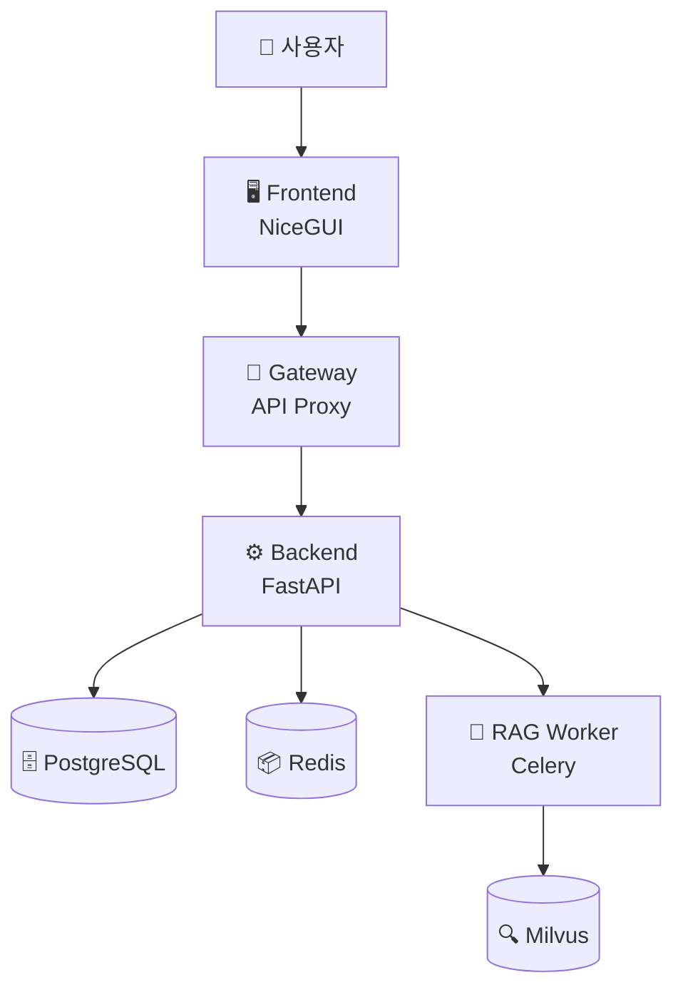

# RAGIT - RAG with Gateway-Backend Architecture

RAGIT은 마이크로서비스 아키텍처 기반의 자체 호스팅 RAG (Retrieval-Augmented Generation) 시스템입니다.
강력한 SDK와 통합 CLI를 제공하여 개발부터 배포까지 원활한 워크플로우를 지원합니다.

## ✨ 주요 특징

- **🏗️ 마이크로서비스 아키텍처**: Gateway-Backend 패턴으로 확장 가능한 구조
- **🚀 통합 SDK**: 모든 기능을 `ragit` 명령어로 통합 관리
- **🐳 Docker 지원**: 개발/프로덕션 환경 분리 배포
- **📊 실시간 모니터링**: 서비스 상태 및 리소스 모니터링
- **🔧 개발자 친화적**: 타입 안전성과 모듈화된 코드 구조

## 🏗️ 프로젝트 구조

```
RAGIT/
├── 📁 backend/              # FastAPI 기반 REST API 서버
│   ├── models/              # SQLAlchemy 데이터 모델
│   ├── services/            # 비즈니스 로직 서비스
│   ├── routers/             # API 라우터
│   └── main.py              # FastAPI 애플리케이션
│
├── 📁 frontend/             # NiceGUI 기반 웹 인터페이스
│   ├── components/          # UI 컴포넌트
│   ├── pages/               # 페이지 모듈
│   ├── services/            # 프론트엔드 서비스
│   └── main.py              # NiceGUI 애플리케이션
│
├── 📁 gateway/              # API 게이트웨이 및 프록시
│   ├── middleware/          # 미들웨어
│   ├── config.py            # 게이트웨이 설정
│   └── main.py              # 게이트웨이 서버
│
├── 📁 rag_worker/           # Celery 기반 RAG 처리 워커
│   ├── tasks/               # 백그라운드 작업
│   ├── models/              # RAG 모델 관리
│   └── main.py              # Celery 애플리케이션
│
├── 📁 ragit_sdk/            # 🆕 통합 관리 SDK
│   ├── cli.py               # Click 기반 CLI 인터페이스
│   ├── process_manager.py   # 로컬 프로세스 관리
│   ├── docker_manager.py    # Docker 컨테이너 관리
│   ├── config.py            # 설정 관리 시스템
│   ├── logger.py            # 통합 로깅 시스템
│   └── utils.py             # 유틸리티 함수
│
├── 📁 scripts/              # 관리 스크립트 (레거시)
├── 📁 docs/                 # 📚 프로젝트 문서
├── 📁 milvus/               # Milvus 벡터 데이터베이스 설정
├── 📁 sample/               # 샘플 데이터 및 예제
│
├── 🐳 docker-compose.yml    # 개발 환경 Docker 설정
├── 🐳 docker-compose.prod.yml # 프로덕션 환경 Docker 설정
├── 🐳 Dockerfile            # Docker 이미지 빌드 설정
├── ⚙️ pyproject.toml        # 프로젝트 설정 및 의존성
├── 🔧 install.sh            # 자동 설치 스크립트
└── 📋 CLAUDE.md             # 개발 코딩 규칙
```

## 🚀 빠른 시작

### 1️⃣ 자동 설치 (Docker - 권장)

```bash
# 저장소 클론
git clone https://github.com/your-repo/RAGIT.git
cd RAGIT

# 원클릭 설치
chmod +x install.sh
./install.sh
```

### 2️⃣ SDK 기반 관리

```bash
# 의존성 설치
uv sync

# 모든 서비스 시작
ragit start

# 서비스 상태 확인
ragit status

# 실시간 모니터링
ragit monitor
```

### 3️⃣ 웹 인터페이스 접속

설치 완료 후 다음 주소로 접속:

- **🌐 웹 인터페이스**: http://localhost:8000
- **🔗 백엔드 API**: http://localhost:8001
- **🚪 게이트웨이**: http://localhost:8080

## 🎯 아키텍처 개요

RAGIT은 다음과 같은 마이크로서비스 아키텍처를 채택합니다:



### 핵심 컴포넌트

- **Frontend (NiceGUI)**: 사용자 인터페이스 및 웹 애플리케이션
- **Gateway**: 요청 라우팅, 로드 밸런싱, 인증 처리
- **Backend (FastAPI)**: 핵심 비즈니스 로직 및 REST API
- **RAG Worker (Celery)**: 비동기 RAG 처리 및 벡터 검색
- **PostgreSQL**: 구조화된 데이터 저장
- **Redis**: 캐싱 및 메시지 큐
- **Milvus**: 벡터 데이터베이스 (RAG 검색용)

## 📚 문서

- **[📖 설치 가이드](docs/installation.md)** - 상세한 설치 및 설정 방법
- **[🔧 SDK 사용 가이드](docs/sdk-usage.md)** - RAGIT SDK 완전 활용법
- **[📋 문서 목록](docs/README.md)** - 모든 문서 색인

## 🎮 주요 명령어

### 서비스 관리
```bash
ragit start                    # 모든 서비스 시작
ragit stop                     # 모든 서비스 중지
ragit restart                  # 모든 서비스 재시작
ragit status                   # 서비스 상태 확인
ragit monitor                  # 실시간 모니터링
ragit config                   # 설정 정보 표시
```

### Docker 관리
```bash
ragit docker build --mode prod    # 프로덕션 이미지 빌드
ragit docker start --mode dev     # 개발 환경 시작
ragit docker logs --service backend  # 백엔드 로그 확인
```

## 🔧 개발 환경

### 요구사항
- **Python**: 3.11+
- **Node.js**: 18+ (프론트엔드 빌드용)
- **Docker**: 20.10+ (컨테이너 배포용)
- **PostgreSQL**: 15+ (로컬 개발용)
- **Redis**: 7+ (로컬 개발용)

### 로컬 개발 설정
```bash
# 의존성 설치
uv sync --dev

# 환경 설정
cp .env.example .env

# 개발 모드 시작
ragit start --mode dev

# 코드 품질 도구
uv run black .                 # 코드 포맷팅
uv run isort .                 # Import 정렬
uv run flake8 .                # 린팅
uv run pytest                  # 테스트 실행
```

## 🏭 배포

### Docker 기반 배포

**개발 환경 (단일 컨테이너):**
```bash
ragit docker start --mode dev
```

**프로덕션 환경 (마이크로서비스 분리):**
```bash
ragit docker build --mode prod
ragit docker start --mode prod
```

### 환경별 설정

- **개발**: `docker-compose.yml` (모든 서비스 단일 컨테이너)
- **프로덕션**: `docker-compose.prod.yml` (서비스별 독립 컨테이너)

## 🤝 기여하기

1. Fork the repository
2. Create your feature branch (`git checkout -b feature/amazing-feature`)
3. Commit your changes (`git commit -m 'Add some amazing feature'`)
4. Push to the branch (`git push origin feature/amazing-feature`)
5. Open a Pull Request

### 개발 규칙

프로젝트는 다음 코딩 원칙을 준수합니다:

- **단일 책임 원칙 (SRP)**: 각 클래스/함수는 하나의 책임만
- **인터페이스 분리 원칙 (ISP)**: 최소 인터페이스 설계
- **타입 어노테이션**: 모든 함수/메서드에 타입 명시

자세한 내용은 [CLAUDE.md](CLAUDE.md)를 참조하세요.

## 📄 라이선스

이 프로젝트는 MIT 라이선스 하에 배포됩니다. 자세한 내용은 [LICENSE](LICENSE) 파일을 참조하세요.

## 📞 지원

- **🐛 버그 신고**: [GitHub Issues](https://github.com/your-repo/RAGIT/issues)
- **💬 토론**: [GitHub Discussions](https://github.com/your-repo/RAGIT/discussions)
- **📧 이메일**: ragit-team@example.com

---

**RAGIT**으로 강력하고 확장 가능한 RAG 시스템을 구축하세요! 🚀
